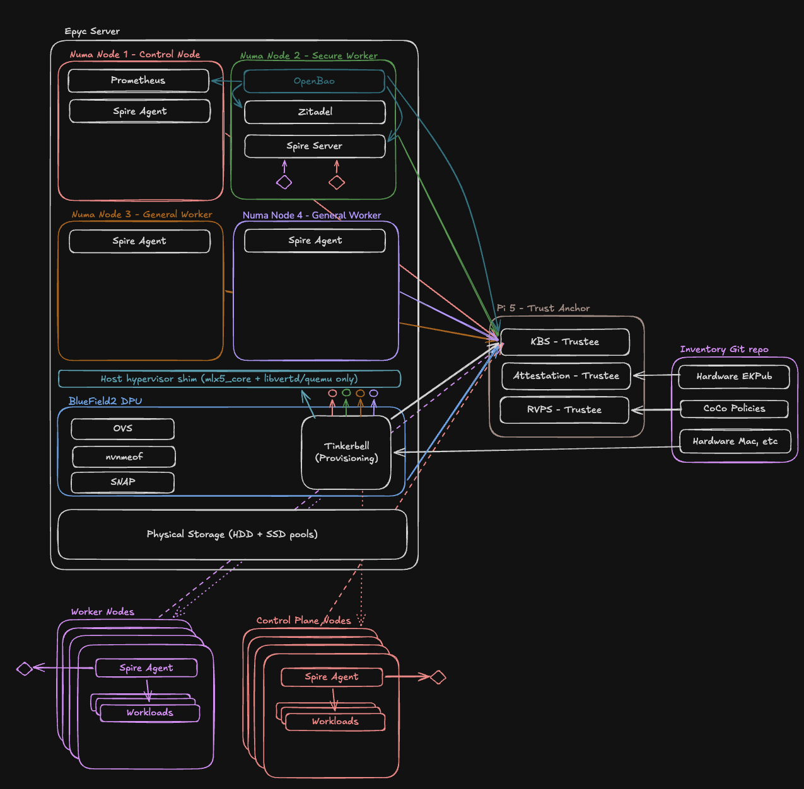
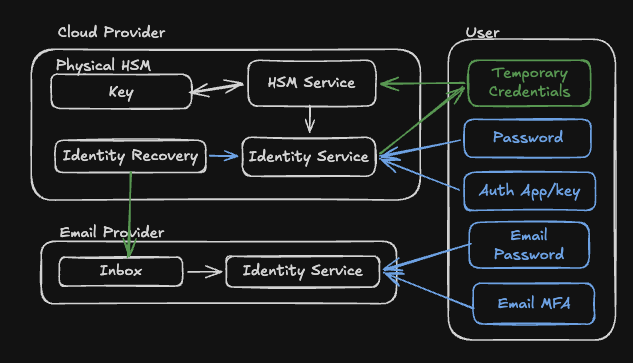
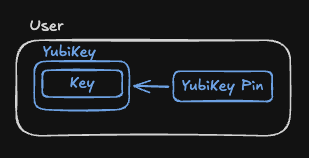

# PicoScaler - WIP
## Overview
This project is designed as a representative implementation of a cloud service provider on a small budget.

## Glossary
* Trusted Execution Environment (TEE) - Hardware enabled feature on certain CPUs that allow creating isolated execution environments with strong guarantees on memory confidentiality, integrity and isolation from other processes running on the hardware.
* AMD-SEV(-SNP) - AMDs implementation of TEE on many of their server level cpus
* Intel SGX - Intels implementation of TEE on their chipsets
* NVMe-oF - NVMe over fabric is a protocol that allows computers to mount remote storage and treat it like a local nvme device from the viewpoint of the kernel.
* Hardware Security Module (HSM) - A hardware device specifically designed to perform cryptographic operations and physically secure keys and secrets.
* Trust Anchor - The component or value that is inherently trustworthy. No other system, or validation process, is required to state that this is trusted. Often this is the root certificate for a Certificate Authority
* Root of Trust - Often also the trust anchor in a system, but the base level authority in a chain of trust which all other trust validations derive from. These are often root certificates issued by a Certificate Authority
* Chain of Trust - A chain of validations that a given process can use to cryptographically prove that each step was issued by the prior link and ultimately trace to a registered root of trust for the given use case

## Scope
The services provided within the cloud ecosystem should be minimal, but functional enough to provide basic useful services for users. The general services considered for this project will be:
### Storage
The service will support three tiers of storage performance generally mapping to u2 nvme backed storage, SAS backed SSD storage and SAS/SATA backed HDD storage. These storage pools will support the following front end storage features:
* Blob storage (like S3)
* Block storage devices (like ebs)
* Kubernetes compatible ephemeral and PVC compatible tiered storage
* Storage will be encrypted at rest
* Nvmeof, or equivalent, support for potential diskless compute nodes
### Compute
There will be three categories of compute considered for the first phase of this service. The available memory associated with compute will be dicated by the nodes available (see constraints)
* Lambda style serverless function execution
* Traditional VM compute workloads
* Namespaced Kubernetes cluster slices with configurable resource limits
### Network
Due to the nature of the project, the public facing features offered will be limited in scope to a single ipv4 front end and assume a single ingress reverse proxy ingress point. This is based on the idea that the services will likely be run off consumer internet plans and/or single public VPS to minimize the public facing surface of the service. With that said here are the proposed networking features that will be offered:
* Workload level (vm/container/service, etc.) public ipv6 allocation and pass through
* Internet gateway approximations that allow specification of which workloads have ingress/egress to the public internet
* Security rules and groups to indicate which ports are allowed in/out to which targets (other security groups/ports&protocols/etc)
* Automated workload subdomain issuance for public ingress (ie uuid.picoscaler.com)
* Automated workload ipv4 port assignmed for public ingress (ie workload:8080 -> public-ip:50000) NOTE: Due to the public ipv4 mapping you will not be able to assign public ipv4 addresses to your vms in this setup.
### Identity / Authorization
Individual users will be able to be added to user pools and associated with a given tenant. As an initial implementation, all users within a tenant will have admin level access to all resources within a given tenant. Workload permissioning will rely on network routing and customer implemented identity management within their own compute. However, future fine grained permissioning should be anticipated within this design and have a clear path forward for extending the implementation as future phases roll out.
### Trust and Security
One goal of this project is to explore design patterns and architectures of major cloud providers and security is one of the major considerations. As such this section will be one area that significantly differs from a typical home lab setup vs a budget cloud provider as being proposed here. As such the following features are being considered as part of the service:
* Zero Trust architecture
* Hardware rooted Certificate Authority for all workloads
* Hardware attestation before any physical node is allowed access to the ecosystem
* Secure container workloads executing in Trusted Execution Environments for select sensitive services (Secret vault, identity provider, etc)
* Workload level identity and secret management
* mTLS for all internal traffic
* Short lived scoped token issuance and validation for any public cloud service endpoint
* DPU gated attestation for supported physical nodes
* TPM attestation support for any physically capable node

## Constraints
### Storage
This is a limited cloud service with highly constrained resource availability compared to a large cloud provider. There will need to be strict limits in place to manage allocation. Here are some of the contraints that will be in place:
* There will be default maximum block storage volume size enforced and pre-set volume size options available at the tenant level on creation. Requires manual approval by the cloud service admin to allocate beyond these limits.
* Default maximum overall storage allocation will be enforced at the tenant level. If a tenant reaches their overall maximum storage allocation, they will not be allowed to initialize more resources without cloud service admin override. (This includes VM allocations that may have minimum storage requirements)
* Storage allocations will also be gated at tier levels. High speed nvme storage space will have much stricter limits vs slower hdd speeds.
### Compute
Smaller compute nodes will be more common on a budget constrained build out due to the prevalence of low powered used workstations. As such, there are two factors to consider when allocating user resources:
* Core count
* Memory caps
These workstations may be running on as low as 8gb of overall RAM and the design should consider these layouts as part of its design. As such the following constraints will need to be in place:
* Tiered limits for high memory/cpu count instance/k8 resource limts and lower core/memory allocations.
* Strict and limited workload/vm deployment shapes to make capacity management easier. 
### Networking
As alluded to during network scoping, this setup will assume a single public facing ipv4 address with access to higher ipv6 allocations. As such the following limits will be considered during design:
* A single gigabit incoming/outgoing internet connection (this is commonly available at reasonable prices in most areas now)
* A single ipv4 adddress with stable dynamic port mapping for backend workloads. A given machines ssh might be port 22 for ipv6, but will have a separate port if utilizing ipv4. The goal is to provide ipv4 non-standard port options in the cases where domain name routing and ipv6 connections are not an option. It is not considered the primary routing option.
* No workload/vm specific public ipv4 addresses
* Limited DDoS protection. If someone targets the ingress point for DDoS, there will be some basic ip/desination filtering (similar to fail2ban) but a low to moderate volume attacker can easily saturate a gigabit connection and shutdown external access to the services. The ingress is a clear availability issue and is an accepted risk as part of the design. For deployments that have multiple ISP providers or public endpoints, configuration guidance will be provided.

## High Level Components

Below is an example of what the physical architecture of the system could look like with specific hardware mentioned for the reference implementation. Description of these components will be outlined below.

### High Level Architecture

### Kuberenetes
To provide maximum flexibility in workload types and storage allocation, all nodes in the network will be deployed as bare metal Kuberenetes nodes. There will be generally three types of nodes/OS configurations that will get deployed:
* Control nodes
* General Worker nodes
* Secure worker nodes (VM/Physical compute with TEE access)

Secure worker nodes will be differentiated from regular worker nodes by applying both taints and node affinities to force all workloads requiring secure containers on to secure worker nodes and generally redirecting non-secure workloads to regular worker nodes where feasible. Depending on exact hardware configurations, those taints may be strict or preference (IE NoExecute vs PreferNoSchedule) oriented based on resource availabilty.

In general, this design is built around multiple low cost and power nodes that will operate as a single bare metal machine kubernetes machine with a specific role (worker vs control). However, there is a need for at least one enterprise level server to provide a TEE and networked storage. To maximize workload placement and resource flexibility multiple isolated vms with potentially different roles will be possible and provisioning/securing these setups will be part of the overall design implementation. Further details can be found in the hardware onboarding and provisioning design.

### Trust Anchor
In order to create a trusted ecosystem there needs to be some component that is outright trusted and used to verify future components. The very root of this setup is going to be a root certificate. The root certificate is the highest trust item and to ensure integrity and confidentiality, should be generated within a hardware backed device. Normally physical enterprise HSMs are far out of budget for a project of this size, but there are some cost effective options that can provide hardware level security for this setup. 

#### Cloud vs hardware HSM
Currently hsm backed keys can be obtained for as low as $1/month and provide hardware backed guarantees that your keys are secure. Generally speaking, the integrity and phsyical security provided by a major cloud provider for the key itself is going to be higher than conumer options. The trade off is that access to the key is now gated by access to, and continued payments for, an account with a cloud provider. 

The main concern is that securing the access to the trust anchor is now inflated with securing access to the cloud account. To avoid conflating the security of personal accounts with the trust anchor, business accounts, business emails and potentially business licenses all need to be maintained in order to properly secure access to the cloud provider. The surface area to secure slowly starts increasing, but the options for recovery (and availablity) of the root key also increase. As an example, the basic setup for a single user account and what the user and the external providers manage is outlined below. User generated and managed secrets are in blue and external provider secrets are in green.
#### User managed Cloud Secrets

On the otherside, there are hardware backed secret options available for key management. The most cost effective and widely available option is the Yubikey. Normally, the yubikey is used for FIDO, or personal second factor, authorization purposes, but it has compatiblity with the PCKS11 api and can securely store and perform operations for asymmetric keys within its hardware. Going this route requires the user to managed the physical key itself and the pin for accessing the key. If the pin or yubikey is lost, then access to the underlying root key is also lost with no chance of recovery.
#### User managed Yubikey secrets

Either of these options are viable for a budget service, but for simplification of the underlying threat model, the rest of the document will assume there is a physical yubikey or equivalent backing for the root certificate.